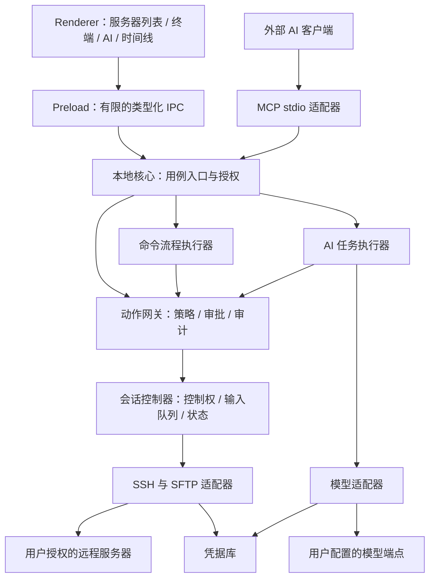

# 系统架构

状态：v0.2 提案；模块边界是目标基线。优先验证 Termix 底座、Tabby 备选，结论见[底座评估](10-open-source-base.md)。已在独立目录验证 Termix 发布源码，实际目录映射见[M0 报告](11-m0-validation.md)；尚未合并为正式产品源码。

## 1. 推荐技术方案

下表是新增协作核心的目标方案。若采用 Termix，应保留其 React/TypeScript 和既有 Electron/本地后端构建方式，逐步接入统一网关；若改选 Tabby，应接受其 Angular 技术栈并重新映射 UI 模块，不为了迁就原提案重写底座。

| 层 | 首版建议 | 选择理由与待验证事项 |
| --- | --- | --- |
| 桌面壳 | Electron 的受支持稳定版本 | 与 TypeScript SSH/MCP 生态衔接直接；需验证 Windows 安装、沙箱与资源使用 |
| 界面 | 优先沿用 Termix 的 React/TypeScript 与终端组件 | 不重写已可用的文件/监控 UI；显示层不承担最终授权 |
| 本地核心 | Node.js + TypeScript，独立于页面 | 统一管理 SSH、控制权、策略和 AI 工具执行 |
| SSH/SFTP | ssh2，通过适配层调用 | 可参考 classfang 的配置/连接实现；主机密钥校验和连接生命周期需独立验证 |
| 配置与记录 | SQLite 元数据 + OS 凭据库 | 密码和 Key 只保存引用；Windows 验证系统加密不可用时的行为 |
| 模型 | 首先支持一种 OpenAI 兼容工具调用协议 | 不假定所有“兼容接口”能力相同；实现能力探测和适配层 |
| MCP | 本机 stdio 适配器 | 首版避免常驻公网 HTTP；外部客户端通过受控本机 IPC 访问核心 |

本稿不指定未经验证的依赖版本。进入开发时锁定版本与依赖文件，并验证干净 Windows 机器的构建结果。

备选 Tauri + Rust 可以另立决策，但会改变 SSH 和 MCP 复用方式。未确认前不同时维护两套桌面技术栈。

## 2. 进程和信任边界

终端输出从 SSH 适配器进入会话事件流，再分别提供给 UI 和经过上下文选择的 AI。页面不能直接建立 SSH、读取私钥、执行本机命令或访问数据库。图中 preload 为候选传输；若沿用 Termix 的本机 HTTP/WebSocket API，需以认证和受限路由实现同样边界，不为统一形式而重写所有已有 API。

桌面主进程负责生命周期与可信 IPC。Termix 验证版已有独立 fork 后端，优先保留该边界并将协作核心放在后端，不把业务搬入页面或 Electron 主进程。耗时解析和终端输出处理不得阻塞接管；是否进一步使用 utility process 由原型测量决定，不改变公开契约。

## 3. 计划中的目录责任

以下路径尚未创建，是逻辑责任划分，不是要求把上游强制移动成这个目录结构。M0 需映射到选定底座的实际目录。每个模块的逻辑所有者为对应领域；当前实际负责人均为项目维护者，不配置自动角色委派。

| 路径 | 唯一主要责任 | 允许依赖 |
| --- | --- | --- |
| apps/desktop/main | 窗口、生命周期、IPC 发送方检查 | core 公开入口、平台适配器 |
| apps/desktop/preload | 固定接口桥接、参数序列化 | contracts |
| apps/desktop/renderer | 页面编排、业务 UI、终端显示 | contracts、公开 preload API |
| packages/contracts | IPC/事件/MCP 内部 DTO 与错误类型 | 无业务实现依赖 |
| packages/core/connections | 服务器配置与主机信任 | connection repository、SSH port |
| packages/core/sessions | 会话、控制权、输出序号、输入串行化 | transport port、事件与审计 port |
| packages/core/policies | 规则决策、范围交集、审批有效性 | contracts；不接触 SSH |
| packages/core/operations | 统一动作网关、幂等与派发编排 | policies、sessions、files 公开入口 |
| packages/core/agent | 模型工具循环、任务边界和预算 | operations、model port、context port |
| packages/core/workflows | 流程定义、串行步骤、暂停与恢复 | operations、workflow repository |
| packages/core/files | SFTP 路径、文件变更与传输生命周期 | SFTP port；写操作仅由网关授权进入 |
| packages/core/editor | 远端文档基线、草稿、差异与保存编排 | files 的只读公开入口；远端写入通过 operations |
| packages/core/tunnels | 隧道配置、启停与资源释放 | SSH forwarding port；启动经过 operations |
| packages/core/metrics | 有限只读采集、采样状态与聚合 | 已授权采集入口；不能直接混入 PTY |
| packages/core/audit | 结构化事件、脱敏与留存 | audit repository、redaction port |
| packages/adapters/ssh | SSH/SFTP 库封装与能力探测 | 核心定义的 ports、凭据 port |
| packages/adapters/model | 模型协议、流式响应与用量解析 | 核心定义的 ports、凭据 port |
| packages/adapters/storage | SQLite repository 和事务实现 | contracts、核心 ports |
| packages/adapters/credentials | OS 凭据库、Key 引用解析 | 平台 API；不依赖 UI |
| packages/adapters/mcp | 外部身份、工具协议、权限映射 | core 公开入口、contracts |

核心规则不依赖 Electron、ssh2、模型 SDK 或数据库驱动。由桌面组合入口注入具体实现。

## 4. 允许与禁止的调用

- UI → 用例 API → operations → 策略/审批 → 会话/文件执行。
- AI 与流程执行器都调用 operations，不直接调用 SSH 库。
- MCP 的目标、身份和权限由适配器认证后附加，不接受工具参数自称“人工”或“管理员”。
- repositories 不能互相直接读取其他领域的数据表；跨模块通过公开用例查询。
- 不建立承载全部业务的 common/utils。无业务归属、稳定且有多个真实调用方时才评估共享抽取。
- 原始终端按键可由 sessions 的人工输入入口处理，但身份、控制权和审计仍需检查；不能伪装成受过完整命令白名单校验。

## 5. 参考代码如何进入项目

classfang/ssh-mcp-server 可以作为 SSH 配置、代理、文件传输和 MCP 协议处理的参考。复用前锁定提交、审查实现与许可证，记录来源和本项目改动。

不直接运行一套拥有独立 SSH 连接和权限的外部服务，再让它绕开本地核心。否则人工终端与 AI 可能落在两个会话中，接管和审计也无法统一。

XTerminal 只作为公开功能和交互设计参考；本稿没有其源码授权依据，不复制其代码、品牌图标或界面素材。

FinalShell 同样用于功能参考。完整底座优先验证 Termix；选定后复用其现有 SSH/SFTP 和设置模块，ssh-mcp-server 不再是必需运行依赖。原有 AI、宏、自动化、文件和隧道入口必须一并纳入网关，不能只检查新写的代码。

## 6. 数据模型与所有权

| 实体 | 关键字段 | 所有模块 |
| --- | --- | --- |
| ConnectionProfile | id、名称、host、port、username、groupIds、credentialRef | connections |
| HostTrust | host、port、算法、指纹、首次/最近确认时间 | connections |
| SecretReference | id、用途、OS 存储定位；不含可返回给 UI 的原文 | credentials |
| Session | id、kind（terminal/files）、活跃连接引用、generation、状态、控制者、controlEpoch | sessions |
| PolicySet | id、scope、revision、规则、默认策略 | policies |
| Approval | operationRef、主体、目标、策略版本、过期时间、是否已消费 | policies |
| Operation | id、requestId、sessionId、actor、状态、结果可信度 | operations |
| AgentTask | id、绑定目标、授权范围、预算、状态、contextCursor | agent |
| WorkflowDefinition | id、version、参数定义、步骤、失败策略 | workflows |
| WorkflowRun | id、revision、定义快照、参数引用、当前步骤、状态 | workflows |
| Transfer | id、operationId、路径、字节数、状态、目标预条件 | files |
| EditorDocument | id、连接身份、远端路径、基线、编码/换行、草稿状态 | editor |
| TransferCheckpoint | transferId、源/目标版本、已传字节、部分文件身份 | files |
| Tunnel | id、连接引用、转发类型、监听与目标范围、状态 | tunnels |
| MetricSample | connectionId、采样时间、指标、采集状态 | metrics |
| AuditEvent | eventId、sessionId、seq、actor、operationId、脱敏数据 | audit |

会话控制权以活跃控制器为权威，持久化状态不能用于重启后自动恢复 AI 写权限。元数据和审计使用事务记录；密码和 API Key 不进入普通 SQLite 字段。

保存的 ConnectionProfile、活跃认证连接、终端 PTY 和文件工作区分别管理生命周期。SFTP 使用独立通道；关闭终端标签不会自动释放仍被文件、传输或隧道使用的认证连接。不同工作区提交同一文件还需路径级互斥与基线检查。

## 7. 输出、上下文和存储

- 终端实时显示读取原始字节流，序号和批次界限由核心分配。
- AI 上下文由专门投影生成，包含获准的输出片段、人工操作摘要和结果，不直接把完整 UI store 发给模型。
- UI 消费慢时使用有界缓存和背压；不能无限堆积内存。
- 原始记录未启用且缓冲已丢弃时，只能报告缺口；不能保证回放全部历史。
- 审计默认脱敏落盘；原始录制、保留时长和容量是显式配置，建议值见安全设计。
- 配置导入导出使用版本化 DTO，不等同于数据库原样复制。

## 8. 生命周期与升级

应用关闭时，默认暂停 AI 和流程派发，并提示是否断开活跃会话。首版不承诺后台常驻执行。

网络重连必须增加 generation、重新核验主机身份、清理旧授权和待发送队列。可以尝试恢复 SSH 连接；远端 PTY 或命令是否存活需重新确认。跨客户端无损恢复留给后续 tmux 等方案。

本地数据迁移有 schemaVersion、迁移前备份和失败退出路径。只承诺本地数据库迁移恢复，不把远端部署变更算作可自动回滚的数据迁移。

## 9. 模块验证方式

policies 使用纯函数场景测试；sessions 使用可控的假 transport 测并发；SSH/SFTP 适配器使用隔离测试机；credentials 在 Windows 实机验证；完整 UI 用 E2E 验证接管和真实输出。具体用例及计划命令见[交付计划](06-delivery.md)。
